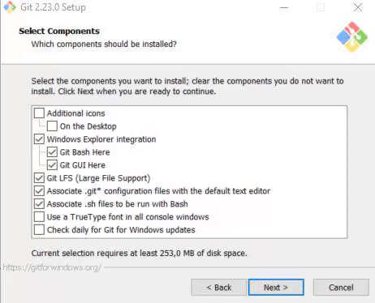
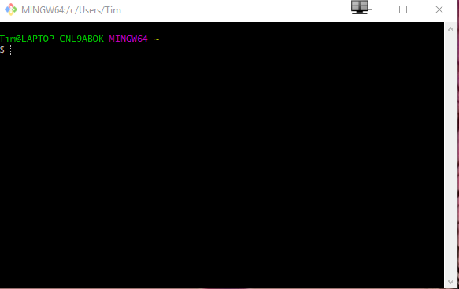
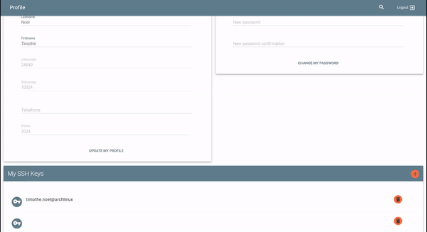
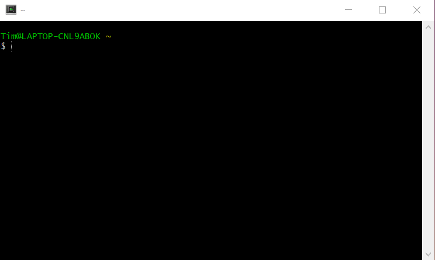

**INSTALLATION GIT**
 - Allez sur https://git-scm.com/downloads et téléchargez git pour votre OS.
 - Lancez l'installation de git sans oublier de cocher la case "Additional Icon" + "On The Desktop" comme ci dessous:
    

   
- Une fois l'installation fini allez sur votre bureau et lancez l'application, vous devriez avoir quelque chose comme ceci:

- Maintenant nous allons commencer  afin de par la configuration de gitrendre vos TP depuis chez vous et de récuperer vos fichiers ect ...
- Executez la commande ```ssh-keygen -t rsa -b 4096 -C "your_email@example.com"``` en remplacant le mail par le votre. Suivez ensuite les instructions et entrez une passphrase si vous voulez (on a déjà fait tout ça au debut d'année)
- Maintenant il va vous falloir récuperer cette clé ssh, pour ce faire vous allez devoir aller soit via votre Explorateur dans le dossier ou executez la commande ```cat /c/users/your_user/.ssh/id_rsa.pub``` en remplacant **your_user** par le votre (Si vous ne le connaissez pas regardez plus haut dans le terminal c'est marqué quelque part)
- Maintenant copiez collez le texte affiché dans votre terminal (ça devrait commencer par **ssh_rsa** et finir par votre **mail**)
- Rendez vous maintenant sur le site du CRI puis faites comme ceci:
   
   
      
      
 - Executez la commande ```git config --global user.name "YOUR_NAME"``` En remplacant **"YOUR_NAME"** par votre nom et prénom
 - Executez la commande ```git config --global user.email "YOUR_MAIL"``` En remplacant **YOUR_MAIL** par votre mail
- Vous êtes maintenant en capacité de récuperer vos fichiers avec, ajouter et rendre vos TP depuis chez vous, ça fonctionne comme en salle machine à Epita.

**INSTALLATION OCAML + GRAPHICS**
 - Rendez vous sur http://fdopen.github.io/opam-repository-mingw/installation/ et téléchargez OCaml
 - Laissez faire l'installation, il installera aussi un autre logiciel appelé "Cygwin"
 - Une fois l'installation faites, lancez Cygwin qui devrait être sur votre Bureau vous devriez avoir quelque chose qui ressemble à ça:
    
  - Executez maintenant la commande ```opam install depext```
 - Executez la commande ```opam install depext-cygwinports```
 - Executez la commande ```opam switch ocaml-variants.4.08.0+mingw64c```
 - Executez la commande ```opam init``` et répondez **yes** à tout
 - Executez la commande ```opam install graphics```
 - Executez la commande ```eval $(opam env)```
 - Vous pouvez maintenant lancer "Ocaml64" et entrer la commande ```ocaml``` puis utiliser toutes les fonctions d'OCaml dont les graphiques :D
